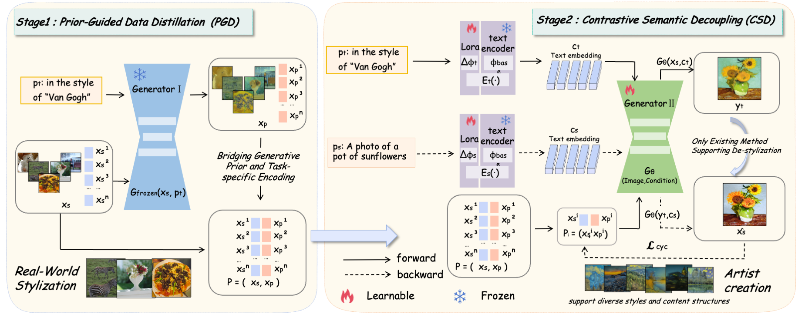

</div><div align="center">
<h1>
StyDeco: Unsupervised Style Transfer with Distilling Priors and Semantic Decoupling [Official Code of PyTorch]
</h1>

<div>
    <a href='https://github.com/QuanjianSong' target='_blank' style='text-decoration:none'>Yuanlin Yang<sup>*</sup></a>, &ensp;
    <a href='https://github.com/QuanjianSong' target='_blank' style='text-decoration:none'>Quanjian Song<sup>*</sup></a>, &ensp;
    <a href='https://github.com/QuanjianSong' target='_blank' style='text-decoration:none'>Zhexian Gao</a>, &ensp;
    <a href='https://github.com/QuanjianSong' target='_blank' style='text-decoration:none'>Ge Wang</a>, &ensp;
    <a href='https://github.com/QuanjianSong' target='_blank' style='text-decoration:none'>Shanshan Li</a>, &ensp;
    <a href='https://github.com/QuanjianSong' target='_blank' style='text-decoration:none'>Xiaoyan Zhang</a>
</div>

<div>
    <sup>*</sup> Equal contribution.
</div>

<sub></sub>

<p align="center">
    <span>
        <a href="https://arxiv.org/pdf/2508.01215" target="_blank"> 
        </a> &emsp;  &emsp; 
    </span>
    <span> 
        <a href='https://github.com/QuanjianSong/LightMotion' target="_blank">
        </a>  &emsp;  &emsp;
    </span>
    <span> 
        <a href='https://huggingface.co/papers/2508.01215' target="_blank"> 
        </a> &emsp;  &emsp;
    </span>
</p>
</div>


## 🎉 News
<pre>
• <strong>2025.08</strong>: 🔥 The official code of StyDeco has been released.
• <strong>2025.08</strong>: 🔥 The paper of StyDeco has been submitted to <a href="https://arxiv.org/pdf/2508.01215">arXiv</a>.
</pre>


## 🎬 Overview
In this paper, we propose StyDeco, an unsupervised framework that resolves this limitation by learning text representations specifically tailored for the style transfer task. Our framework first employs Prior-Guided Data Distillation (PGD), a strategy designed to distill stylistic knowledge without human supervision. It leverages a powerful frozen generative model to automatically synthesize pseudopaired data. Subsequently, we introduce Contrastive Semantic Decoupling (CSD), a task-specific objective that adapts a text encoder using domain-specific weights. CSD performs a twoclass clustering in the semantic space, encouraging source and target representations to form distinct clusters. The overall framework is illustrated as follows:


## 🔧 Environment
```
git clone https://github.com/QuanjianSong/StyDeco.git
# Installation with the requirement.txt
conda create -n StyDeco python=3.10
conda activate StyDeco
pip install -r requirements.txt
# Or installation with environment.yaml
conda env create -f environment.yaml
```

## 🔥 Train
```
bash train_StyDeco.sh
```

## 🚀 Inference
```
bash start_StyDeco.sh
```

## 🎓 Bibtex
🤗 If you find this code helpful for your research, please cite:
```
@article{yang2025stydeco,
  title={StyDeco: Unsupervised Style Transfer with Distilling Priors and Semantic Decoupling},
  author={Yang, Yuanlin and Song, Quanjian and Gao, Zhexian and Wang, Ge and Li, Shanshan and Zhang, Xiaoyan},
  journal={arXiv preprint arXiv:2508.01215},
  year={2025}
}
```
